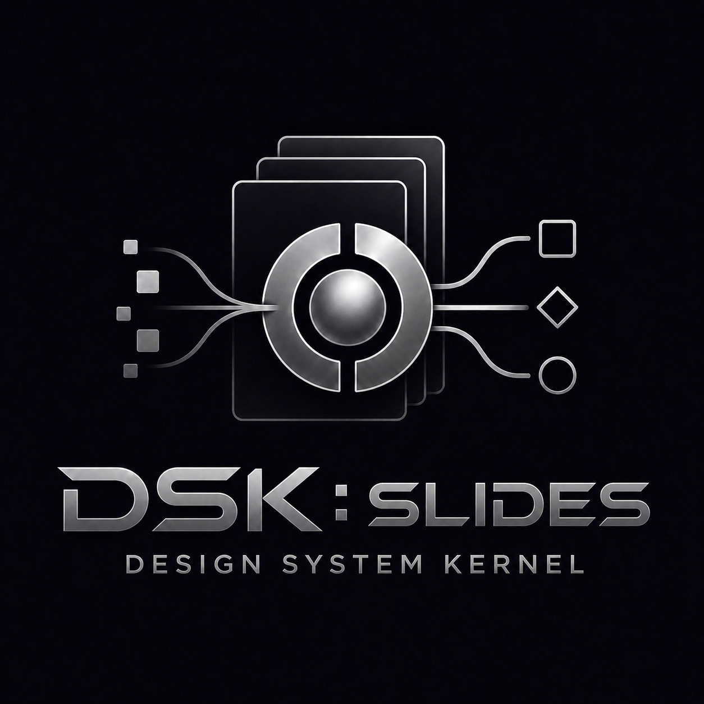

<p align="center">
  
</p>

# DSK: Slides

The slides plugin in the Design System Kernel (DSK) family.

DSK is a portable pattern: turn a company's declared source of truth into a stable intermediate snapshot (structured data plus rendered visuals), then have an AI agent generate web-rendered artifacts faithful to that source.

**DSK: Slides** is the slides instantiation of that pattern. The agent reads a company's PowerPoint master and generates on-brand slides via chat in Claude Design (or equivalent AI Design Tool), instead of composing them manually in PowerPoint or Keynote. Future DSK plugins for other artifact families (posters, reports, branded documents, etc.) would follow the same source → snapshot → renditions shape.

Scope today: PowerPoint as source, Claude Design as host. DSK: Slides is designed vendor-neutral and engine-pluggable, so additional source engines (Keynote, Google Slides, Figma, design tokens, etc.) and other folder-based AI Design Tool hosts can be added in the future. Those are part of the design intent, not currently implemented.

## See how it works

- **[Lifecycle diagrams](dsk/skills/context/lifecycles.md)** — mermaid flowcharts of setup, compose, and sync (renders inline on GitHub).
- **[Walkthrough](dsk/skills/context/walkthrough.md)** — step-by-step `[You]` / `[DSK]` scenarios from the user's perspective.

## Repository layout

- **`dsk/`** — the plugin itself. Install via the marketplace flow (see below), or load directly with `claude --plugin-dir dsk` for development. See [`dsk/README.md`](dsk/README.md) for the skill list.
- **[`REQUIREMENTS.md`](REQUIREMENTS.md)** — top-level table of contents for the design.
- **`requirements/`** — design documents (principles, architecture, types, content input, separation, snapshotting, degrees of freedom, glossary, developer testing, open questions). For DSK maintainers and contributors. The plugin runtime does not depend on these files; they describe the system from outside.

## What's included

- Ten skills (`dsk:context`, `dsk:help`, `dsk:setup`, `dsk:snapshot-ppt`, `dsk:build`, `dsk:compose`, `dsk:refine`, `dsk:sync`, `dsk:route-extension`, `dsk:dof`)
- A two-stage pipeline: **snapshot** (extract structured slide data plus screenshots from the source) and **build** (produce the library — both web-rendered slide _renditions_ that `dsk:compose` reuses, and _library pages_ humans browse). See [outputs.md](requirements/outputs.md).
- Shared snapshot schema and validator (`dsk/lib/snapshot/`)
- Vendor-neutral project context via `AGENTS.md` (with a `CLAUDE.md` symlink for Claude tooling)
- Six independent ownership fingerprints (skill namespace, AGENTS.md DSK section, .gitignore DSK section, manifest schema, snapshot schema, `.dsk-managed` markers)

The snapshot stage is host-portable (principle 11) and can be exercised in Claude Code or any skill-compatible runtime; see [`requirements/developer-testing.md`](requirements/developer-testing.md).

## Install

The plugin lives at `dsk/` inside this repository, so the repo doubles as a single-plugin **marketplace** (`.claude-plugin/marketplace.json` at the root). In Claude Code (and Claude Design when supported), install with:

```
/plugin marketplace add dawid-dahl-umain/design-system-kernel
/plugin install dsk@design-system-kernel
```

> **TODO (pre-launch):** the marketplace URL above (`dawid-dahl-umain/design-system-kernel`) is DSK's current development location. At launch this will move to a permanent owner/repo; substitute the new `<owner>/<repo>` portion of the install command then. The marketplace name (`design-system-kernel`) and plugin name (`dsk`) are stable across moves.

For local development without going through the marketplace flow, clone the repo and load the plugin folder directly:

```
claude --plugin-dir /path/to/design-system-kernel/dsk
```

## Quickstart

1. Install the plugin (see above).
2. Open a project folder and drop your company's declared source file into `source/` (for MVP, a PowerPoint master).
3. Run `/dsk:setup` (or say "set up DSK"). The agent walks you through the rest.

For the full skill list, system dependencies, and the developer-testing flow, see [`dsk/README.md`](dsk/README.md).
