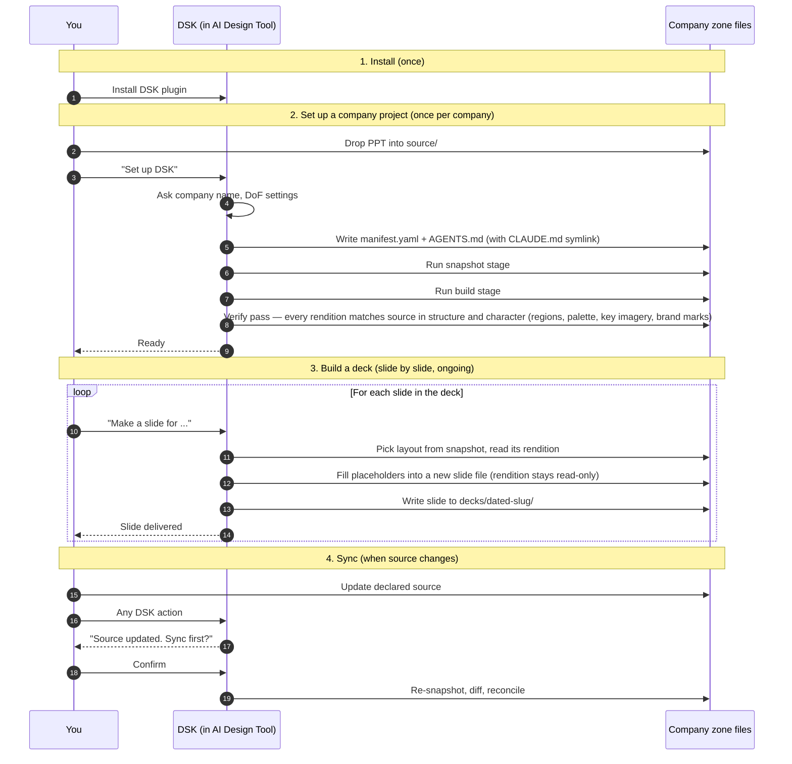
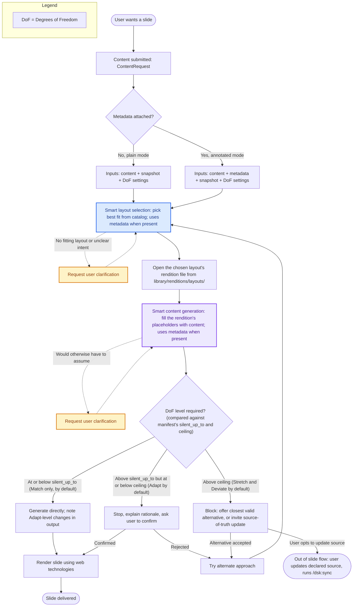
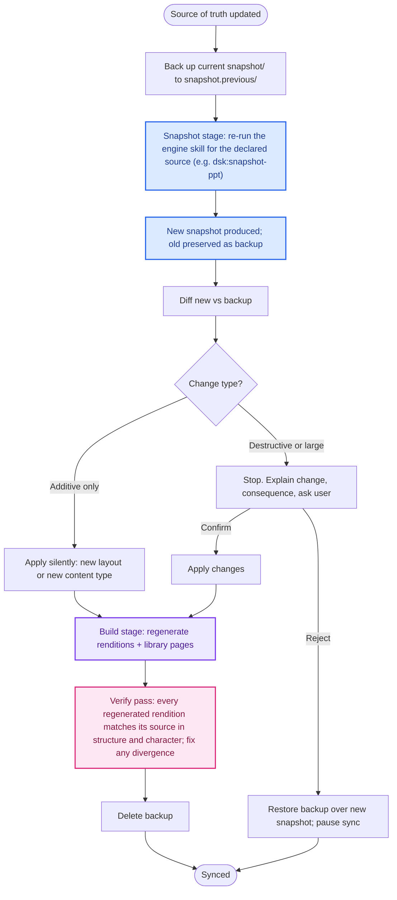
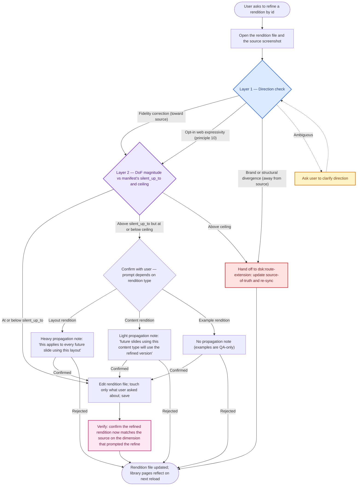

# DSK lifecycles — diagrams

High-level diagrams of the three core DSK lifecycles. Each is an agentic flow; diagrams describe behavior, not implementation (principle 7). Read by you (the agent) when invoked from `dsk:context`; the canonical visual reference for DSK behavior. Show these to the user when explaining where they are in the lifecycle.

The DSK pipeline has three named phases that show up in setup and sync:

- **Snapshot stage**: an engine skill (`dsk:snapshot-<format>`, e.g. `dsk:snapshot-ppt` for PowerPoint) reads the source of truth and writes the `DesignSystemSnapshot` (slide-specific data plus PNG screenshots). Each source format has its own engine skill; the manifest's `engine` field selects which one.
- **Build stage**: the agent reads the snapshot and the kernel briefs and produces two artifact categories — **renditions** (web-rendered versions of every layout, example, and content item, the actual slides and content pieces compose reuses) and **library pages** (the browser around them). Visual output, in a different medium than the declared source. Renditions may pause to ask the user for design-system direction; library page chrome does not.
- **Verify pass**: the agent's final acceptance gate. Every rendition tile is held next to its source screenshot and confirmed to match on both axes — *structure* (regions, primitives, spatial relationships) and *character* (palette, key imagery, brand marks, decorative motifs, overall visual feel). Anything that diverges on either axis is fixed before the build is declared done. Lives inside the build skill's responsibility but called out as a discrete phase because it's the moment the agent stands behind the library: a build with renditions that look right on one axis but wrong on the other is a failure, even when step-by-step generation looked fine.

## 0. Overview — the whole lifecycle end to end

A high-level sequence of every interaction across the install/setup/build/sync lifecycle. Use this when the user asks "how does DSK work overall?" or needs to see the full picture before diving into a specific flow.

The three sections below zoom in on each individual lifecycle.

## 1. Setup — creating a new design system

A company sets up DSK inside their AI Design Tool for the first time.

```mermaid
flowchart TD
    Start([Empty AI Design Tool folder]) --> InstallKernel["Install DSK: copy the kernel files (skills, briefs, vocabularies) into the folder"]
    InstallKernel --> AddSource["Add the company's declared source file to source/"]
    AddSource --> RunSetup["Invoke /dsk:setup"]
    RunSetup --> AskConfig["Agent asks: company name, DoF ceiling, silent threshold"]
    AskConfig --> WriteManifest["Write the manifest (config: source path + DoF settings)"]
    WriteManifest --> WriteAgentsMd["Write or extend AGENTS.md (project marker; with CLAUDE.md symlink for Claude tooling; existing content preserved, see principle 8)"]
    WriteAgentsMd --> RunSnapshot["Snapshot stage: run the engine skill for the source format (e.g. dsk:snapshot-ppt for PPT)"]
    RunSnapshot --> SnapshotWritten["Snapshot written: snapshot.json + screenshots + source-media in snapshot/"]
    SnapshotWritten --> Build["Build stage: agent reads the snapshot + the kernel briefs"]
    Build --> CheckDS{"Brand sources for renditions? (host feature, user-provided folder, or source-extracted media)"}
    CheckDS -->|Covers what's needed| Renditions["Generate renditions: one HTML file per layout, example, and content type, in library/renditions/{layouts,examples,content}/"]
    CheckDS -->|Specific gap remains| AskUser["Ask user: brand guidelines, essentials, approximate from source, or generic defaults"]
    AskUser --> Renditions
    Renditions --> LibraryProduced["Library produced: renditions + browser pages (welcome, layouts, examples, content gallery)"]
    LibraryProduced --> Verify["Verify pass: every rendition tile held next to its source screenshot — structure (regions, primitives, spatial relationships) and character (palette, key imagery, brand marks, decorative motifs, overall feel); fix any divergence before declaring done"]
    Verify --> Ready([Ready: users can chat with the agent])

    classDef snapshotStage fill:#dbeafe,stroke:#2563eb,stroke-width:2px,color:#1e3a8a
    classDef buildStage    fill:#ede9fe,stroke:#7c3aed,stroke-width:2px,color:#4c1d95
    classDef verifyStage   fill:#fce7f3,stroke:#db2777,stroke-width:2px,color:#831843
    classDef clarify       fill:#fef3c7,stroke:#d97706,stroke-width:2px,color:#92400e
    class RunSnapshot,SnapshotWritten snapshotStage
    class Build,Renditions,LibraryProduced buildStage
    class Verify verifyStage
    class CheckDS,AskUser clarify
```

## 2. Compose — generating a slide

Content arrives first. `ContentRequest` is the conceptual shape; in practice the agent sees one of two modes: **plain** (the user types content directly into chat — most common) or **annotated** (content arrives as a structured payload with metadata, from any producer — AI or traditional software, DSK doesn't care about the source). **If content is missing or unclear, the agent pauses and asks before any smart step — never invents content. If the agent can't classify between plain and annotated, it asks; if still ambiguous, it falls back to plain mode for robustness.** Once content is in hand, the agent performs two smart steps regardless of mode:

1. **Smart layout selection**: pick the best layout from the snapshot catalog.
2. **Smart content generation**: fill that layout with the content.

Both steps draw on the same inputs: the content itself, the snapshot, the manifest's DoF settings (`ceiling` and `silent_up_to`), and metadata when present. The DoF decision (match/adapt/stretch/deviate) is the gating output of generation.

If at any point the agent would otherwise have to make an assumption to proceed (no layout fits cleanly, content intent is ambiguous, a rendering choice is genuinely unclear), it pauses and asks the user instead of guessing.

## 3. Sync — source of truth changed

The company updates their source. The agent re-snapshots and reconciles, never destroying without consent (principle 8).

Sync is user-invoked via `/dsk:sync`. The agent does not auto-sync or watch the filesystem. It checks source mtime when invoked for any DSK action; if the source has changed since the last snapshot, it surfaces a polite reminder before proceeding with the requested action.

## 4. Refine — adjusting a specific rendition

User-invoked iteration on a single rendition (layout, example, or content item) without rebuilding the whole library. Triggered when a user spots a fidelity gap between a rendition and its source via the library's "compare to source" view, and asks the agent to fix it. Especially common for content items — charts, tables, diagrams — where first-pass renditions tend to drift from source visually.

Two-layer test before any change is applied. Direction first (is this a correction toward source, opt-in web expressivity, or a brand/structural divergence?), then DoF magnitude (same ladder compose uses). The asymmetry that's specific to refine: the confirmation message at the magnitude stage depends on which kind of rendition is being refined, because layout refinements propagate to all future composes while example refinements don't.

