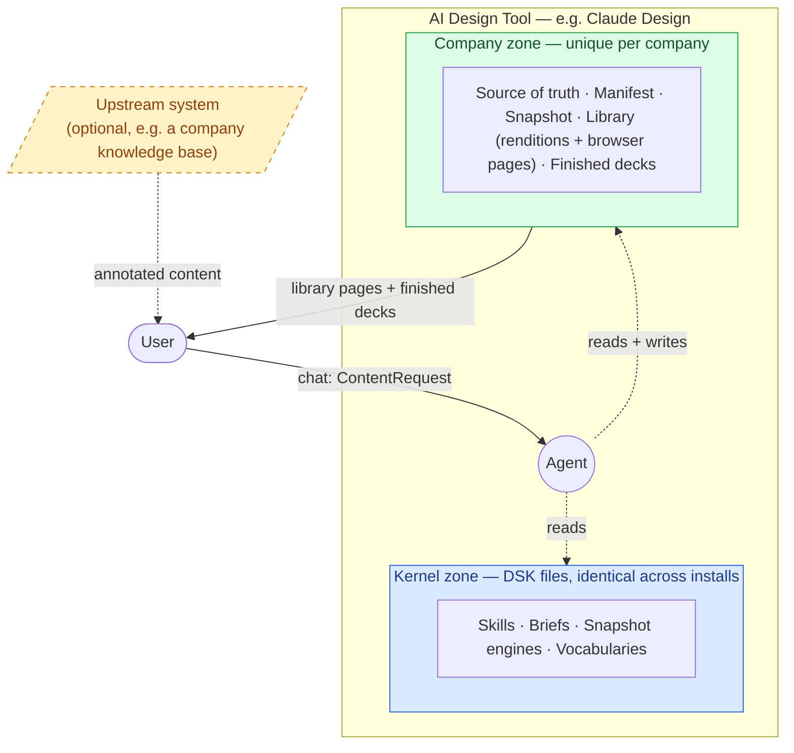

# Architecture

How DSK fits into a company's environment, and where the parts live. This is the structural picture; for the runtime lifecycle diagrams (setup, compose, sync) see `dsk/skills/context/lifecycles.md` in the plugin.



## Reading the diagram

- **AI Design Tool.** The host DSK plugs into. Claude Design today; any folder-and-file based agentic environment in principle.
- **Kernel zone (DSK).** The portable, company-agnostic files DSK ships with: skills, briefs, snapshot engines, vocabularies. Identical across every install. This is "DSK itself."
- **Company zone.** Per-company files: source of truth (PPT primary), manifest, snapshot plus assets, library (renditions and the browser pages around them — see [outputs.md](outputs.md)), finished decks.
- **Agent.** The runtime. Reads from the kernel zone for behavior rules, reads and writes the company zone for company-specific content.
- **Upstream AI process (optional).** An external system the company may have, such as a knowledge base or content generator. Produces annotated content that the user can submit. DSK consumes the metadata when present. See [content-input.md](content-input.md).
- **User.** Chats with the agent, receives library pages and finished decks.

## Why two zones

The split is what makes DSK portable. The kernel zone is identical for every company; the company zone is everything specific. Drop the same kernel into any new company's folder, point it at their source of truth, and DSK works without modification. See [separation.md](separation.md) for the full rationale.

## Relationship to a host's own design-system feature

DSK is host-neutral by design (principle 6). Some AI Design Tools have their own built-in design-system feature that handles brand primitives at the host or organization level. DSK's stance is the same regardless of which host:

- **The host's DS** (when present) answers "what does this brand look like?" Brand primitives (colors, typography, components, logos), applied broadly to any output the host generates.
- **DSK** answers "how do slides specifically use that brand?" Slide-specific structure: named layouts with placeholder positions, filled examples per layout, a content catalog with construction notes, DoF rules.

The two are not redundant; they cover different scopes and coexist as peer skill bundles in the same project. DSK deliberately delegates theme colors, typography, logos, embedded images, and reusable components to whatever brand-primitive source the host provides (see [snapshotting.md](snapshotting.md) and principle 6). If a host DS is present, DSK composes with it. If not, the agent must read equivalent primitives from the source files or ask the user for them. DSK does not duplicate that layer in `snapshot.json`.

### Example: Claude Design

As one concrete example of a host with a built-in DS feature, Claude Design's design system is itself a Skill bundle — same plugin convention DSK uses. A typical Claude Design DS folder looks like:

```
SKILL.md              # the DS skill manifest (name, description, user-invocable: true)
README.md             # brand rules: voice, colors, visual foundations, iconography
colors_and_type.css   # design tokens (colors, fonts, spacing, radii, shadows) as CSS variables
preview/              # HTML cards rendered in the host's "Design System" tab
  colors-*.html
  type-*.html
  buttons.html
  cards.html
  ...
assets/               # logos and brand imagery
fonts/                # font files (or substitutes)
uploads/              # source assets that seeded the design system
```

This layout is illustrative — it reflects Claude Design's behavior as observed at the time of writing. Claude Design itself may change its structure over time, and other AI Design Tools will organize their DS feature differently. **DSK does not pattern-match against specific filenames or paths.** It relies on the agent picking up on whatever brand primitives the host provides, however they happen to be organized. This follows principle 7: the contract is behavior-level (the host provides brand primitives), not file-layout level.

Once published at the org level, Claude Design projects auto-apply this skill. Notice the parallel: the host's `preview/` HTML cards are visual reference for brand primitives (one per palette, button style, type specimen); DSK's `library/` HTML pages are visual reference for slide-specific structure (one per layout, example, content type). Same medium, different scope. They compose.

The same composition pattern applies to any AI Design Tool with a similar feature; DSK does not depend on a Claude-Design-specific format or behavior.

DSK's engine model is pluggable. A future engine could read a host's DS files directly (e.g. parsing CSS tokens or a brand `README.md`) as a brand-primitive source — but this is out of scope for MVP since we delegate brand primitives to the host runtime.

---

[← Back to overview](../REQUIREMENTS.md)
