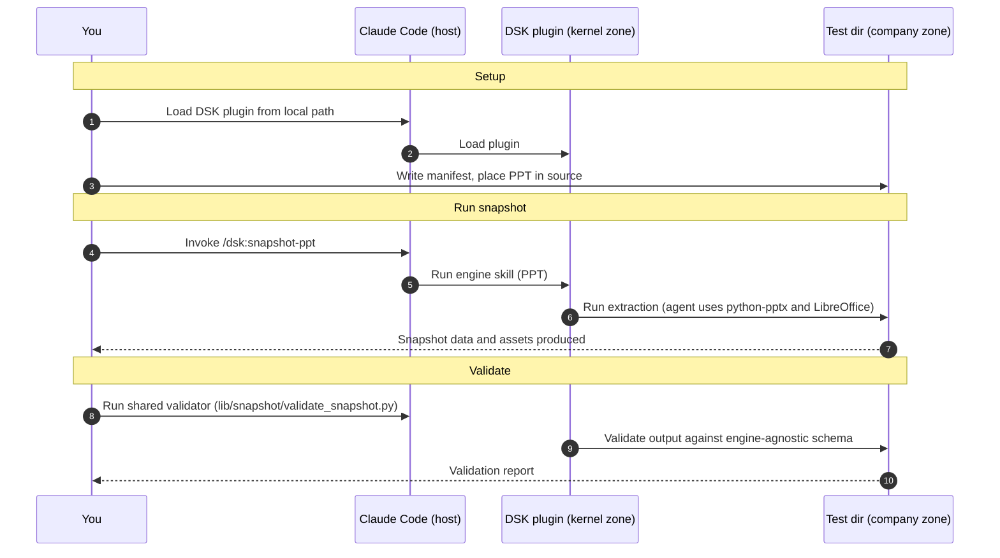

# Developer testing — exercising DSK without an AI Design Tool

Audience: DSK maintainers (you, while building or improving DSK). Not end users; for end-user scenarios see `dsk/skills/context/walkthrough.md` in the plugin.

For fast iteration without spending AI Design Tool tokens. Principle 11 makes the snapshot stage host-portable specifically so this kind of testing can happen in Claude Code (or Codex, or any skill-compatible runtime).

## What you can test here

- The full snapshot stage: PPT → `snapshot.json` plus `assets/`. Driven by the agent following `dsk:snapshot-ppt/SKILL.md`, using python-pptx and LibreOffice via tool calls.
- Manifest validation, snapshot validation, snapshot diff. These are the deterministic parts (small scripts).

## What you cannot fully exercise here

The skills below all *run* in Claude Code; what's missing is the host AI Design Tool's rendering and preview integration, not the file generation itself.

- The Build stage. `library/welcome.html` and the other pages are produced fine in Claude Code — open them in a browser to inspect. What you don't see here is the host AI Design Tool's inline preview and integration with the rest of its surface.
- `dsk:compose` (slide generation), `dsk:sync` user-facing logic, `dsk:route-extension` prose. Same shape: the artifacts are valid; the host-integrated UX is what's not exercised.

## At a glance

## Steps

The plugin does not ship a sample PPT. Bring your own (any PowerPoint master file with defined layouts will do).

1. `[You]` Clone the `design-system-kernel` repo locally.
2. `[You]` Open Claude Code in a test directory containing your sample PPT.
3. `[You]` Load the plugin: `claude --plugin-dir <path-to-dsk>`.
4. `[You]` Write a minimal `manifest.yaml`; place the PPT in `source/`.
5. `[You]` Invoke `/dsk:snapshot-ppt`, or ask the agent to run it.
6. `[DSK]` Agent extracts the snapshot per `dsk:snapshot-ppt/SKILL.md`: uses python-pptx for layout metadata, LibreOffice headless for PNG renders, writes `snapshot/snapshot.json` plus PNG assets.
7. `[You]` Run the shared validator (`dsk/lib/snapshot/validate_snapshot.py`), or ask the agent to validate.
8. `[You]` Inspect the output against expected values; iterate without ever touching the AI Design Tool.

## Why this works

The DSK plugin is just a folder of skills and scripts following Anthropic's plugin convention. Any agent runtime that supports the format can load it. The snapshot stage uses only file I/O and standard tools (python-pptx, JSON, filesystem). No platform-specific APIs.

This is the practical payoff of principle 6 (vendor-neutral by construction) and principle 11 (snapshot stage is host-portable).

---

[← Back to overview](../REQUIREMENTS.md)
